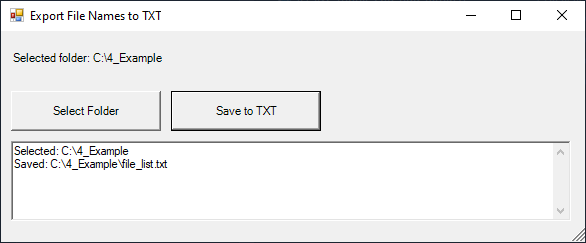
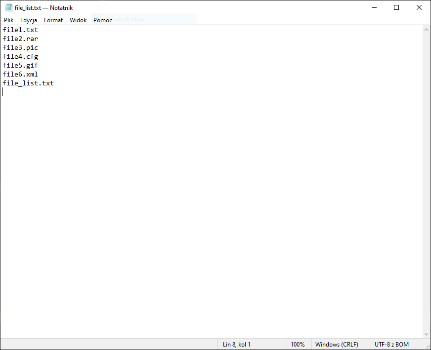
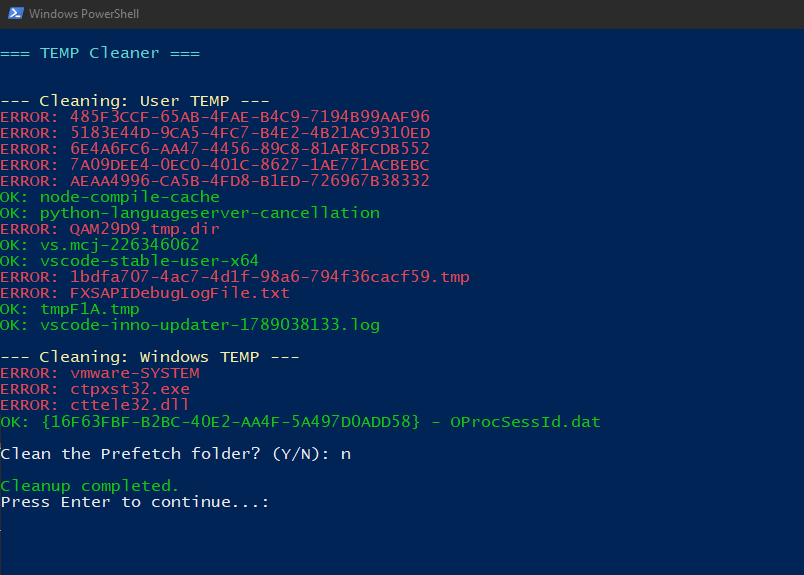
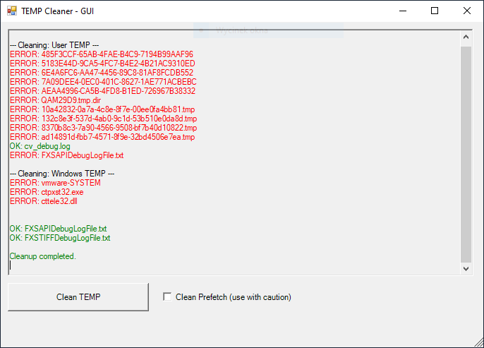
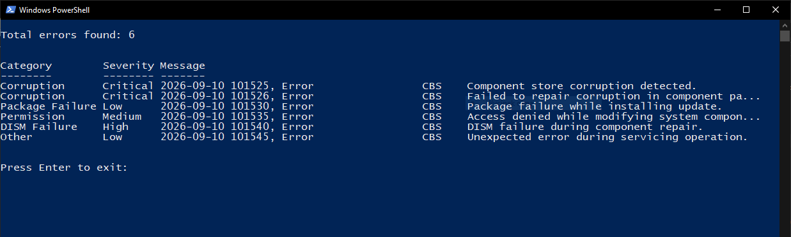
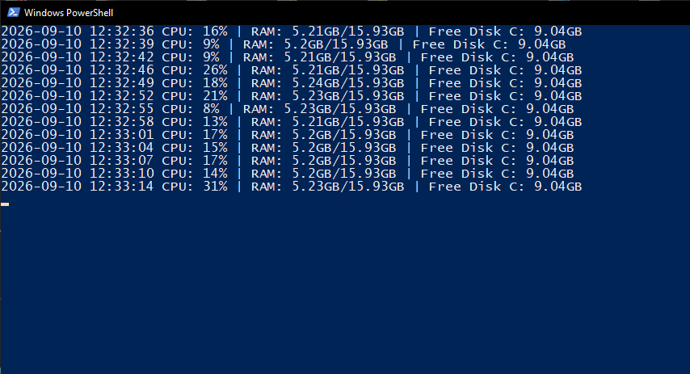

# PowerShell Administration Toolkit

Collection of PowerShell scripts for Windows administration, system maintenance, monitoring and log analysis.

The project contains practical automation scripts for common administrative tasks such as file inventory, temporary file cleanup, system resource monitoring and Windows CBS log analysis.

## Included Scripts

### 01_list_files_gui.ps1

Graphical tool for exporting file names from a selected folder to a TXT file.

**Features**

* Folder selection dialog
* Export file names to TXT
* Simple Windows Forms GUI
* Status and error messages



Example of the generated file list:



---

### 02_temp_cleaner.ps1

Console utility for cleaning temporary Windows files.

**Features**

* Cleans user TEMP directory
* Cleans Windows TEMP directory
* Optional Prefetch cleanup
* Colored console output
* Basic error handling

Example:



---

### 02_temp_cleaner_gui.ps1

GUI version of the temporary file cleaner.

**Features**

* Windows Forms interface
* Real-time log output
* User TEMP and Windows TEMP cleanup
* Optional Prefetch cleanup
* Colored status messages
* Basic error handling



---

### 03_cbs_error_report.ps1

Parses a sample Windows `CBS.log` file and classifies detected errors.

**Features**

* Detects error entries
* Categorizes common issues
* Assigns severity levels
* Displays summarized results

The repository includes `CBS_sample.log` for testing the script.



---

### 04_live_monit_cpu_hdd_ram.ps1

Real-time Windows system monitoring tool.

**Features**

* CPU utilization monitoring
* RAM usage monitoring
* Free disk space monitoring
* Live console output
* CSV logging every 2 seconds

The collected data is saved to `monitor.csv` and can be further analysed in applications such as Microsoft Excel.



## Technologies

* PowerShell 5.1+
* Windows Forms
* WMI / CIM
* CSV reporting

## Requirements

* Windows 10 / Windows 11
* Windows PowerShell 5.1 or PowerShell 7
* Administrator privileges recommended for some scripts

## Usage

Run any script from PowerShell:

```powershell
.\01_list_files_gui.ps1

.\02_temp_cleaner.ps1

.\02_temp_cleaner_gui.ps1

.\03_cbs_error_report.ps1

.\04_live_monit_cpu_hdd_ram.ps1
```

## Future Improvements

* Event Log analysis
* Windows Update reporting
* Disk health monitoring (SMART)
* Email notifications
* HTML dashboard
* Scheduled task support
* Performance graphs

## License

MIT License
